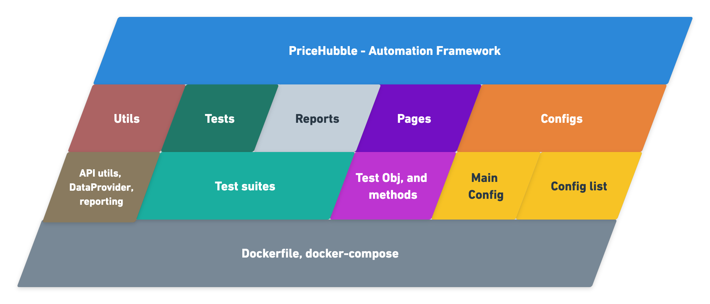
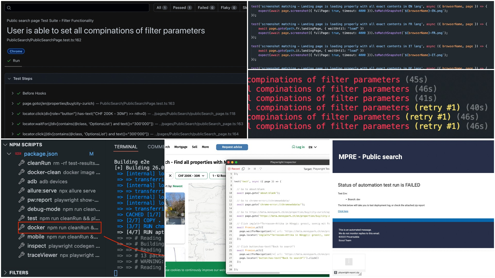
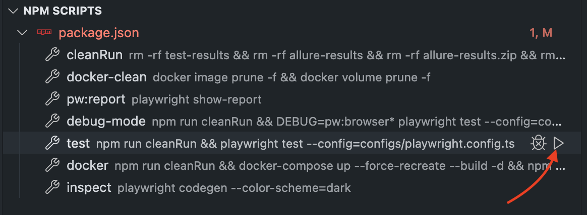

<p align="right"></p>

# PriceHubble - Automation framework Boilerplate 


This Repository is limited for use only for pricehubble


# Overview

This Automation Framework skeleton has been built as a boilerplate or reference for the QA engineers and developers  who might be involved into writing an automated test cases, aiming to standarize the way we are implementing our automation test that can help steamline the development process and increase the product quality, ease test cases developments, by embodies best practices and providing test cases examples with friendly syntax to make wirting test more simple, robust and maintainable, the automation framework is based on playwright.

## Structure
**High-level diagram and flows**

   <p align="center">
    
   </p>

Framework skeleton is consisting of multiple directories as shown above since the framework is built using page object pattern so we will see that we have two directories pages and tests, pages contain test steps and page elements while tests are containing the relevant test suites for each application page, configs contain the main playwright config file where it's reading all data from the shared config file, so the engineer can just edit the config list values according to the project needs, reports contains an HTML report that will be generated after a run, utils contains API utils, helping methods, data-provider contains randomly generated data and supporting functions, also report config file, last but not least we have dockerfile and docker-compose file to ease execution.
 
## Features and benifits
- Fast execution time and support for parallel testing
- Support cross browser testing againt chrome, firefox, edge and webkit
- Support API out of the box
- Snapshot screen matching
- Retry on failed 
- Html report with screenshot, video recording and network tracing
- Sending report with all neccessary data after each run to email list
- Support different view ports to mimic mobile browsers on different platform.
- Codegen helps in extracting test method and elements which make writing test cases more faster and simpler

<p align="center">
    
</p>

## Get Started

### Installation
  - simpley run: ```npm i```

### Commands
- ```npm run test``` : will clean up previous repport  & execute all test suite with your relevant config file
- ```npm run docker``` :  clean up report, remove all dangled images and volumes, create new image and run test.
- ```npm run inspect``` : will instintiate a playwright inspector session to use codegen feature
- ```npm run debug-mode``` : will run playwright in debugging mode
- ```npm run pw:report```: will display playwright html report in browser tab

    

### Settings & Configs
- You will find all required configs to be adjusted/edit in ./configs/configlist.ts   
- .env file to pass there all required environment varaiable

### Page objects and test cases
- In the pages directory you will need to create your class in .ts file
- Import any require library as shown below
- Identify you consturctor 
- Define you the page element and requies test objects

```
import { Page } from "playwright-core";

export default class LandingPage {

    private page: Page

    constructor(page: Page) {
        this.page = page;
    }

    /********************************************************** Elements ********************************************************* */

    textElement(text: string) { return this.page.locator(`text=${text} >> nth=0`) }
    get searchInput() { return this.page.locator('input[placeholder] >> nth=0') }

    /********************************************************** Actions ********************************************************* */

    async waitForText(text: string){
        await this.textElement(text).waitFor()
        return this;
    }
}
```
- Import your class into exporter.ts
```
   import LandingPage from "./PublicSearch/landing_page";

   export { LandingPage };
```
- Make your test cases more clean by adding fixture in fixture.ts as shown below
```
import { test as base } from '@playwright/test';
import { LandingPage } from './exporter';

const fixtures = base.extend<{ landingPage: LandingPage }>({

    landingPage: async ({ page }, use) => {
        const landingPage = new LandingPage(page)
        await use(landingPage)
    }

});

export { fixtures };
```
- Now you would be easily able to write you test as following
```
import { expect } from '@playwright/test';
import { fixtures as test } from '../../pages/fixture';

test.describe('Landing page Test Suite', () => {

    test.beforeEach(async ({ page, landingPage }) => {
        await page.goto(path.en.landingPage, { waitUntil: "load", timeout: 30000 })
    });

    test('screenshot matching - Landing page is loading properly with all exact contents in EN lang', async ({ browserName, page }) => {
        expect(await page.screenshot({ fullPage: true, timeout: 4000 })).toMatchSnapshot(`${browserName}-EN.png`);
    });
})
```